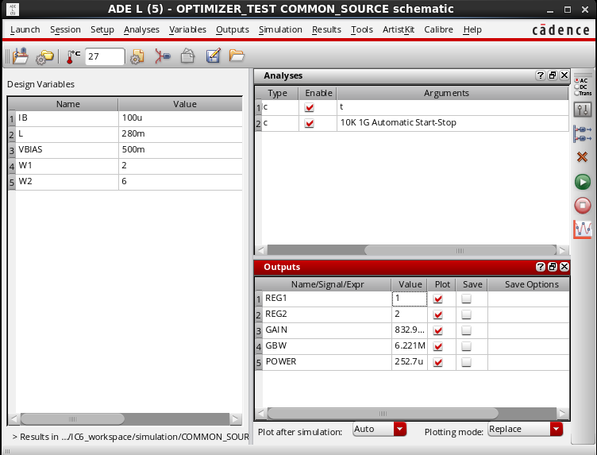
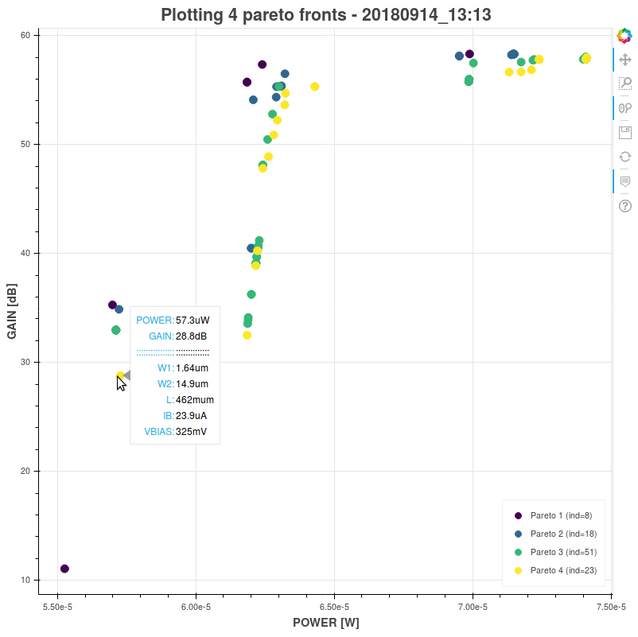

# Optimization of a common-source circuit using HEROiC and ADE-XL <!-- omit in toc -->


**Author name:** Miguel Fernandes  
**Author e-mail:** mdm.fernandes@gmail.com

This tutorial/guide demonstrates how to use the Heuristic ciRcuit Optimizer for Cadence (HEROiC) to optimize a simple common-source circuit on Cadence Virtuoso.

The purpose of this document is to demonstrate, in detail, how to configure and use **HEROiC** to optimize circuits using Cadence Virtuoso. **HEROiC** uses the Cadence *ADE-XL* environment to perform the circuit simulations, which has some advantages when compared with the *ADE-L* environment:

* Support multiple parallel simulations, which reduces considerably the overall optimization time more than half in some cases);
* Support corner analysis and Monte Carlo analysis.

**NOTE:** If *ADE-XL* is not available, the optimizer can be modified to work with *ADE-L*. This modification is straight forward and only the *script* files need to be changed (the *script* files can be found in [Section 2.2](#2.2.-Split-the-configurations-file)).

The **HEROiC** is divided in two programs that can be executed in different machines:

* The first program is designated as **HEROiC server** (for simplification), and is responsible to run the *Cadence Virtuoso*, which performs the circuit simulations, and to make the bridge between *Cadence Virtuoso* and the **HEROiC** optimizer. All files required to run this program are located in the *heroic_cadence* folder inside the project directory;
* The second program is designated as **HEROiC client** and is responsible to carry on the optimization process and to exchange the required information with *Cadence Virtuoso* through the **HEROiC server**. All files required to run this program are located in the *heroic* folder inside the project directory.

## Table of Contents <!-- omit in toc -->

* [1. Design the circuit and configure the simulation sub-environment](#1-design-the-circuit-and-configure-the-simulation-sub-environment)
    * [1.1. Design the circuit](#11-design-the-circuit)
    * [1.2. Configure the simulation sub-environment using *ADE-L*](#12-configure-the-simulation-sub-environment-using-ade-l)
* [2. Configure the simulation environment using *ADE-XL*](#2-configure-the-simulation-environment-using-ade-xl)
    * [2.1. Configure the *ADE-XL* environment](#21-configure-the-ade-xl-environment)
    * [2.2. Split the configuration file](#22-split-the-configuration-file)
        * [2.2.1. Original configuration file](#221-original-configuration-file)
        * [2.2.2. Split configuration files](#222-split-configuration-files)
* [3. Configure HEROiC](#3-configure-heroic)
    * [3.1. Change the *HEROiC server* side configurations](#31-change-the-heroic-server-side-configurations)
    * [3.2. Change the *HEROiC client* side configurations](#32-change-the-heroic-client-side-configurations)
* [4. Optimize the circuit](#4-optimize-the-circuit)
    * [4.1. Run the *HEROiC server*](#41-run-the-heroic-server)
    * [4.2. Run the *HEROiC client*](#42-run-the-heroic-client)
        * [4.2.1. Run the optimizer in normal mode](#421-run-the-optimizer-in-normal-mode)
        * [4.2.2. Run the optimizer from a *checkpoint*](#422-run-the-optimizer-from-a-checkpoint)
        * [4.2.3. Running example](#423-running-example)
    * [4.3. About *checkpoints* and the *logbook*](#43-about-checkpoints-and-the-logbook)
        * [4.3.1. Checkpoints](#431-checkpoints)
        * [4.3.2. Logbook](#432-logbook)
* [5. Analyze the results](#5-analyze-the-results)
* [6. Troubleshooting](#6-troubleshooting)
* [References](#references)
* [Appendix 1 - How to connect to *HEROiC server* through *ssh*](#appendix-1---how-to-connect-to-heroic-server-through-ssh)
* [Appendix 2 - Configure an Anaconda environment to run *HEROiC client*](#appendix-2---configure-an-anaconda-environment-to-run-heroic-client)

## 1. Design the circuit and configure the simulation sub-environment

This circuit was designed with the STM 65nm technology, using Cadence Virtuoso IC6.1.7-64b.500.15 and the ADE-XL environment.

### 1.1. Design the circuit

The common-source (CS) circuit is shown below.


After designing the circuit, the parameters to optimize need to be associated with variables (e.g. width of transistor *M1* is named **W1**, biasing current is named **IB**, and so on). For this specific circuit, the author defined the following parameters/variables and respective values range:

| Parameter [units] |               Description              | Min. | Max. |
|-------------------|----------------------------------------|:----:|:----:|
| W1 [um]           | Width of the transistor M1             | 1    | 100  |
| W2 [um]           | Width of the transistors M2 and MB     | 3    | 100  |
| L [um]            | Length of all transistors              | 0.14 | 0.56 |
| IB [A]            | Biasing current of the current-mirror  | 10   | 100  |
| VBIAS [V]         | Biasing voltage of the transistor M1   | 0.3  | 1    |

Each variable needs to have minimum and maximum values associated. These values are either defined by the used technology or set by the user, to limit the search space (bigger search space = higher optimization time). Also, the variables units need to be the same as those of Cadence, for compatibility issues.

### 1.2. Configure the simulation sub-environment using *ADE-L*

Before configuring the simulation files using *ADE-XL* it is mandatory to configure *ADE-L* because each *test* of *ADE-XL* will inherit the environment defined in *ADE-L*. This setup is highly circuit-dependent, and for this circuit is the following:



These are the steps performed to achieve the state shown in the figure:

1. Import the variables to the *ADE-L* (`Variables -> Copy From Cellview`). The chosen values are not important because they will be modified by the optimizer;
2. Define the analysis to perform. In this example the author chose the following:
    * DC - to get the transistors' operating regions, and the overall power consumption;
    * AC - to get the circuit gain and GBW.
3. Set the simulation outputs, as following:
    * GAIN - `ymax(mag(v(\"/out\" ?result \"ac\"))`
    * REG1 - `pv(\"M1.m1\" \"region\" ?result \"dcOpInfo\")`
    * REG2 - `pv(\"M2.m1\" \"region\" ?result \"dcOpInfo\")`
    * POWER - `(- pv(\"V0\" \"pwr\" ?result \"dcOpInfo\"))`
    * GBW - `gainBwProd(mag(v(\"/out\" ?result \"ac\"))) || 0.0`

The DC outputs (REG1, REG2, POWER) are easily obtained from the `Tools -> Results Browser...` menu, and the AC outputs (GAIN, GBW) can be obtained from the `Tools -> Calculator...`.

**NOTE:** In the GBW output, the expression ends with "`|| 0.0`". This sub-expression indicates that the GBW default value is 0.0 (with type = float), i.e. if the simulator can't obtain the GBW value, it will assign zero to GBW. This prevents simulation errors that can broke the program. The author didn't use this sub-expression in other simulation outputs because they always have a valid value and also because the author is lazy :p.

After setting the *ADE-L* environment, perform a simulation and be sure that there are no errors and the simulation outputs are correctly displayed. **Don't forget to save the simulation state at the end as it will be required in the next step!!!**

**NOTE:** Every time that a circuit is created/modified, or that the *simulation* folder is deleted, it is necessary to run a simulation at least once to generate the circuit netlist! (and also to check if there's no errors).

## 2. Configure the simulation environment using *ADE-XL*

This is the trickiest part of the configuration. This step comprises two main tasks:

1. Configure the *ADE-XL* environment and export an OCEAN script with the configurations.
2. Split the configurations file in three files to:
    1. Load the simulator (in this example is *Spectre*) \[once per program execution\];
    2. Load the circuit variables before run a simulation \[for every simulation\];
    3. Run a simulation and save the outputs in a file \[for every simulation\].

### 2.1. Configure the *ADE-XL* environment

To configure the *ADE-XL* environment you need to follow these steps:

1. Open the *ADE-XL* and create a new view.
2. Add a test. In the *Data View* window click on *Tests* and it opens an environment similar to the *ADE-L* where you can load the state saved in the previous step.
3. If you don't want to run *corners* and *point sweep*, disable these analysis in the *Run Summary* window.
4. Check that you have the *parallel run* enabled in `Options -> Run Options`. This will allow to run parallel simulations to speed up the optimization process.
5. Save the *ADE-XL* state.
6. Export an ocean script with the configurations in `File -> Save script`.

### 2.2. Split the configuration file

Open the previous saved configuration file. First I will show the original configurations file that I obtained for my circuit and then I will show the three files and explain the major differences. The three resulting files are available in the project folder in `heroic_cadence -> script` and can be used as template for your circuit.

#### 2.2.1. Original configuration file

```lisp
;====================== Set to XL mode =========================================
ocnSetXLMode()
ocnxlProjectDir( "./simulation" )
ocnxlTargetCellView( "OPTIMIZER_TEST" "COMMON_SOURCE" "adexl" )
ocnxlResultsLocation( "" )
ocnxlSimResultsLocation( "" )
ocnxlMaxJobFail( 20 )

;====================== Tests setup ============================================

;---------- Test "OPTIMIZER_TEST:COMMON_SOURCE:1" -------------
ocnxlBeginTest("OPTIMIZER_TEST:COMMON_SOURCE:1")
simulator( 'spectre )
design( "OPTIMIZER_TEST" "COMMON_SOURCE" "schematic")
modelFile(
    '("/home/mdm.fernandes/IC6_workspace/nominal/spectre/nominalwrapper.scs" "")
)
definitionFile(
    "models.scs"
)
analysis('dc ?saveOppoint t  )
analysis('ac ?start "10k"  ?stop "1G"  )
desVar(   "IB" 100u      )
desVar(   "L" 0.28       )
desVar(   "VBIAS" 500m   )
desVar(   "W1" 2         )
desVar(   "W2" 6         )
envOption(
    'firstRun  t
    'analysisOrder  list("dc" "ac" "pz" "dcmatch" "stb" "tran" "envlp" "lf" "noise" "xf" "sp" "pss" "pac" "pstb" "pnoise" "pxf" "psp" "qpss" "qpac" "qpnoise" "qpxf" "qpsp" "hb" "hbac" "hbstb" "hbnoise" "hbxf" "sens" "acmatch")
)
temp( 27 )
ocnxlOutputExpr( "ymax(mag(v(\"/out\" ?result \"ac\")))" ?name "GAIN" ?plot t)
ocnxlOutputExpr( "pv(\"M2.m1\" \"region\" ?result \"dcOpInfo\")" ?name "REG2" ?plot t)
ocnxlOutputExpr( "pv(\"M1.m1\" \"region\" ?result \"dcOpInfo\")" ?name "REG1" ?plot t)
ocnxlOutputExpr( "gainBwProd(mag(v(\"/out\" ?result \"ac\"))) || 0" ?name "GBW" ?plot t)
ocnxlOutputExpr( "(- pv(\"V0\" \"pwr\" ?result \"dcOpInfo\"))" ?name "POWER" ?plot t)
ocnxlEndTest() ; "OPTIMIZER_TEST:COMMON_SOURCE:1"

;====================== Sweeps setup ===========================================
ocnxlSweepVar("IB" "100u")
ocnxlSweepVar("L" "0.28")
ocnxlSweepVar("VBIAS" "500m")
ocnxlSweepVar("W1" "2")
ocnxlSweepVar("W2" "6")

;====================== Model Group setup ======================================

;====================== Corners setup ==========================================

;====================== Checks and Asserts setup ===============================
ocnxlPutChecksAsserts(?netlist nil)

;====================== Job setup ==============================================
ocnxlJobSetup( '(
    "blockemail" "1"
    "configuretimeout" "300"
    "distributionmethod" "Local"
    "lingertimeout" "300"
    "maxjobs" "1"
    "name" "ADE XL Default"
    "preemptivestart" "1"
    "reconfigureimmediately" "1"
    "runtimeout" "-1"
    "showerrorwhenretrying" "1"
    "showoutputlogerror" "0"
    "startmaxjobsimmed" "1"
    "starttimeout" "300"
    "usesameprocess" "1"
) )

;====================== Disabled items =========================================

;====================== Run Mode Options =======================================

;====================== Starting Point Info ====================================

;====================== Run command ============================================
ocnxlRun( ?mode 'sweepsAndCorners ?nominalCornerEnabled t ?allCornersEnabled nil ?allSweepsEnabled nil)
ocnxlOutputSummary(?exprSummary t ?specSummary t ?detailed t ?wave t)
ocnxlOpenResults()

;====================== End XL Mode command ====================================
ocnxlEndXLMode()
```

#### 2.2.2. Split configuration files

##### loadSimulator.ocn

```lisp
setup(?numberNotation 'engineering)
ddCreateLib("OPTIMIZER_TEST" "/home/mdm.fernandes/Projects/optimizer/OPTIMIZER_TEST")

;====================== Set to XL mode =========================================
ocnSetXLMode()
ocnxlProjectDir( "/home/mdm.fernandes/IC6_workspace/simulation" )
ocnxlTargetCellView( "OPTIMIZER_TEST" "COMMON_SOURCE" "adexl" )
ocnxlResultsLocation( "" )
ocnxlSimResultsLocation( "" )
ocnxlMaxJobFail( 20 )

;====================== Tests setup ============================================
;---------- Test 1 -------------
ocnxlBeginTest("test:1")
simulator( 'spectre )
design("/home/mdm.fernandes/IC6_workspace/simulation/COMMON_SOURCE/spectre/schematic/netlist/netlist")
modelFile(
    '("/home/mdm.fernandes/IC6_workspace/nominal/spectre/nominalwrapper.scs" "")
)
definitionFile(
    "models.scs"
)
analysis('ac ?start "10k"  ?stop "1G"  )
analysis('dc ?saveOppoint t  )
desVar(   "IB" 100u     )
desVar(   "L" 0.28      )
desVar(   "VBIAS" 500m  )
desVar(   "W1" 2        )
desVar(   "W2" 6        )
envOption(
    'analysisOrder  list("dc" "ac")
)
temp( 27 )
ocnxlOutputExpr( "ymax(mag(v(\"/out\" ?result \"ac\")))" ?name "GAIN" ?plot t)
ocnxlOutputExpr( "pv(\"M2.m1\" \"region\" ?result \"dcOpInfo\")" ?name "REG2" ?plot t)
ocnxlOutputExpr( "pv(\"M1.m1\" \"region\" ?result \"dcOpInfo\")" ?name "REG1" ?plot t)
ocnxlOutputExpr( "gainBwProd(mag(v(\"/out\" ?result \"ac\"))) || 0.0" ?name "GBW" ?plot t)
ocnxlOutputExpr( "(- pv(\"V0\" \"pwr\" ?result \"dcOpInfo\"))" ?name "POWER" ?plot t)
ocnxlEndTest() ; "test:1"

;---------- Test 2 -------------
ocnxlBeginTest("test:2")
simulator( 'spectre )
design("/home/mdm.fernandes/IC6_workspace/simulation/COMMON_SOURCE/spectre/schematic/netlist/netlist")
modelFile(
    '("/home/mdm.fernandes/IC6_workspace/nominal/spectre/nominalwrapper.scs" "")
)
definitionFile(
    "models.scs"
)
analysis('ac ?start "10k"  ?stop "1G"  )
analysis('dc ?saveOppoint t  )
desVar(   "IB" 100u     )
desVar(   "L" 0.28      )
desVar(   "VBIAS" 500m  )
desVar(   "W1" 2        )
desVar(   "W2" 6        )
envOption(
    'analysisOrder  list("dc" "ac")
)
temp( 27 )
ocnxlOutputExpr( "ymax(mag(v(\"/out\" ?result \"ac\")))" ?name "GAIN" ?plot t)
ocnxlOutputExpr( "pv(\"M2.m1\" \"region\" ?result \"dcOpInfo\")" ?name "REG2" ?plot t)
ocnxlOutputExpr( "pv(\"M1.m1\" \"region\" ?result \"dcOpInfo\")" ?name "REG1" ?plot t)
ocnxlOutputExpr( "gainBwProd(mag(v(\"/out\" ?result \"ac\"))) || 0.0" ?name "GBW" ?plot t)
ocnxlOutputExpr( "(- pv(\"V0\" \"pwr\" ?result \"dcOpInfo\"))" ?name "POWER" ?plot t)
ocnxlEndTest() ; "test:2"

;---------- Test 3 -------------
ocnxlBeginTest("test:3")
simulator( 'spectre )
design("/home/mdm.fernandes/IC6_workspace/simulation/COMMON_SOURCE/spectre/schematic/netlist/netlist")
modelFile(
    '("/home/mdm.fernandes/IC6_workspace/nominal/spectre/nominalwrapper.scs" "")
)
definitionFile(
    "models.scs"
)
analysis('ac ?start "10k"  ?stop "1G"  )
analysis('dc ?saveOppoint t  )
desVar(   "IB" 100u     )
desVar(   "L" 0.28      )
desVar(   "VBIAS" 500m  )
desVar(   "W1" 2        )
desVar(   "W2" 6        )
envOption(
    'analysisOrder  list("dc" "ac")
)
temp( 27 )
ocnxlOutputExpr( "ymax(mag(v(\"/out\" ?result \"ac\")))" ?name "GAIN" ?plot t)
ocnxlOutputExpr( "pv(\"M2.m1\" \"region\" ?result \"dcOpInfo\")" ?name "REG2" ?plot t)
ocnxlOutputExpr( "pv(\"M1.m1\" \"region\" ?result \"dcOpInfo\")" ?name "REG1" ?plot t)
ocnxlOutputExpr( "gainBwProd(mag(v(\"/out\" ?result \"ac\"))) || 0.0" ?name "GBW" ?plot t)
ocnxlOutputExpr( "(- pv(\"V0\" \"pwr\" ?result \"dcOpInfo\"))" ?name "POWER" ?plot t)
ocnxlEndTest() ; "test:3"

;---------- Test 4 -------------
ocnxlBeginTest("test:4")
simulator( 'spectre )
design("/home/mdm.fernandes/IC6_workspace/simulation/COMMON_SOURCE/spectre/schematic/netlist/netlist")
modelFile(
    '("/home/mdm.fernandes/IC6_workspace/nominal/spectre/nominalwrapper.scs" "")
)
definitionFile(
    "models.scs"
)
analysis('ac ?start "10k"  ?stop "1G"  )
analysis('dc ?saveOppoint t  )
desVar(   "IB" 100u     )
desVar(   "L" 0.28      )
desVar(   "VBIAS" 500m  )
desVar(   "W1" 2        )
desVar(   "W2" 6        )
envOption(
    'analysisOrder  list("dc" "ac")
)
temp( 27 )
ocnxlOutputExpr( "ymax(mag(v(\"/out\" ?result \"ac\")))" ?name "GAIN" ?plot t)
ocnxlOutputExpr( "pv(\"M2.m1\" \"region\" ?result \"dcOpInfo\")" ?name "REG2" ?plot t)
ocnxlOutputExpr( "pv(\"M1.m1\" \"region\" ?result \"dcOpInfo\")" ?name "REG1" ?plot t)
ocnxlOutputExpr( "gainBwProd(mag(v(\"/out\" ?result \"ac\"))) || 0.0" ?name "GBW" ?plot t)
ocnxlOutputExpr( "(- pv(\"V0\" \"pwr\" ?result \"dcOpInfo\"))" ?name "POWER" ?plot t)
ocnxlEndTest() ; "test:4"

;====================== Job setup ==============================================
ocnxlJobSetup( '(
    "blockemail" "1"
    "configuretimeout" "300"
    "distributionmethod" "Local"
    "lingertimeout" "300"
    "maxjobs" "4"
    "name" "ADE XL Default"
    "preemptivestart" "1"
    "reconfigureimmediately" "1"
    "runtimeout" "-1"
    "showerrorwhenretrying" "0"
    "showoutputlogerror" "0"
    "startmaxjobsimmed" "1"
    "starttimeout" "300"
    "usesameprocess" "1"
) )
```

**Main differences:**

* The sections *Sweep Setup*, *Model Group Setup*, *Corners Setup*, and *Checks and Asserts Setup* were removed from the file because they are not required for the analysis that we want to perform.
* Add the `setup(?numberNotation 'engineering)` line to format the numbers with engineering notation.
* Add the `ddCreateLib("OPTIMIZER_TEST" "/home/mdm.fernandes/Projects/optimizer/OPTIMIZER_TEST")` line. This line creates a *cds.lib* file with our circuit library (in this case the library name was *OPTIMIZER_TEST*, located in `/home/mdm.fernandes/Projects/optimizer/OPTIMIZER_TEST` (you can get this line from the original *cds.lib* file located in the Cadence root directory). Since the **loadSimulator.ocn** is not loaded from the Cadence root directory, it can't find the libraries that are defined in the original *cds.lib*.
* Modify the name of the tests to "test" (e.g. for the first test: **ORIGINAL**: `ocnxlBeginTest("OPTIMIZER_TEST:COMMON_SOURCE:1")` -> **MODIFIED**: `ocnxlBeginTest("test:1")`. This name is required to change the circuit variables during the optimization, and the optimizer assumes that the tests have the name "test".
* Change the line `design("OPTIMIZER_TEST" "COMMON_SOURCE" "schematic")` to `design("/home/mdm.fernandes/IC6_workspace/simulation/COMMON_SOURCE/spectre/schematic/netlist/netlist")`, where the new directory is the location of the circuit *netlist*. If you can't find the netlist directory, you can check it on the simulation log in *ADE-L* or you can generate a configuration file of the *ADE-L* session in *Session -> Save Ocean Script..." and find it in the generated file.
* Simplify the line `'analysisOrder  list("dc" "ac" "pz" "dcmatch" "stb" "tran" "envlp" "lf" "noise" "xf" "sp" "pss" "pac" "pstb" "pnoise" "pxf" "psp" "qpss" "qpac" "qpnoise" "qpxf" "qpsp" "hb" "hbac" "hbstb" "hbnoise" "hbxf" "sens" "acmatch")` to only include the required simulations (in this case *dc* and *ac*).
* Replicate the test section for the **exact number of parallel simulations that one want to run** <sup>Note 1</sup>, and change the tests numbers. In this case, the author specified four parallel simulations:

```lisp
;====================== Tests setup ============================================
;---------- Test 1 -------------
ocnxlBeginTest("test:1")
...
ocnxlEndTest() ; "test:1"

;---------- Test 2 -------------
ocnxlBeginTest("test:2")
...
ocnxlEndTest() ; "test:2"

;---------- Test 3 -------------
ocnxlBeginTest("test:3")
...
ocnxlEndTest() ; "test:3"

;---------- Test 4 -------------
ocnxlBeginTest("test:4")
...
ocnxlEndTest() ; "test:4"
```

* Change the `"maxjobs" "1"` in `ocnxlJobSetup` to at least the number of parallel simulations that one want to perform (for this tutorial `"maxjobs" "4"`)

**<sup>Note 1</sup>** The optimizer uses the number of tests defined in this file to automatically determine the number of parallel simulations that Cadence executes.

##### run.ocn

```lisp
;====================== Open output file ======================
out_path = getShellEnvVar("RESULT_FILE")
outf = outfile(out_path "w")

;======================= Run command ==========================
ocnxlRun( ?mode 'sweepsAndCorners ?nominalCornerEnabled t ?allCornersEnabled nil ?allSweepsEnabled nil ?verboseMode nil)

;====================== Print to file =========================
; Get the number of simulations from an environment variable
n_sim = getShellEnvVar("HEROIC_N_SIM")
n_sim = atoi(n_sim)

for( i 1 n_sim
    sprintf(name "test:%d" i)

    ; Modify from here
    POWER = calcVal("POWER" name)
    GAIN = calcVal("GAIN" name)
    REG1 = calcVal("REG1" name)
    REG2 = calcVal("REG2" name)
    GBW = calcVal("GBW" name)

    fprintf( outf "%s\t%e\n", "POWER", POWER)
    fprintf( outf "%s\t%g\n", "GAIN", GAIN)
    fprintf( outf "%s\t%d\n", "REG1", REG1)
    fprintf( outf "%s\t%d\n", "REG2", REG2)
    fprintf( outf "%s\t%g\n", "GBW", GBW)
    ; Modify up to here
)

;====================== Close output file =====================
close(outf)
```

This script opens the file to save the simulation outputs. The user only needs to modify the code inside the for loop, according to the simulation outputs specified in **loadSimulator.ocn**. Be careful with the chosen format specifiers (e.g. `%d`) as they need to match the type of data of the output.

The `?verboseMode nil` in the `ocnxlRun` command disables the verbosity of the simulation status, to speed up the simulations. The user can enable it if has problems with the simulation.

##### vars.ocn

```lisp
ocnxlSelectTest("test:1")
desVar(   "IB" 100u     )
desVar(   "L" 0.28      )
desVar(   "VBIAS" 500m  )
desVar(   "W1" 2        )
desVar(   "W2" 6        )
ocnxlSelectTest("test:2")
desVar(   "IB" 100u     )
desVar(   "L" 0.28      )
desVar(   "VBIAS" 500m  )
desVar(   "W1" 2        )
desVar(   "W2" 6        )
ocnxlSelectTest("test:3")
desVar(   "IB" 100u     )
desVar(   "L" 0.28      )
desVar(   "VBIAS" 500m  )
desVar(   "W1" 2        )
desVar(   "W2" 6        )
ocnxlSelectTest("test:4")
desVar(   "IB" 100u     )
desVar(   "L" 0.28      )
desVar(   "VBIAS" 500m  )
desVar(   "W1" 2        )
desVar(   "W2" 6        )
```

This file contains the circuit variables for all tests, and is modified by the optimizer during the evolution process. Each test is selected by the `ocnxlSelectTest("test:x")` command. The user must create this file before run the optimizer, because the program uses this file to check if the circuit variables match the variables defined on the optimizer configuration file (more on this later).

The good thing is that you only need to do this once per circuit :D (except if you change circuit/simulation parameters, but that is trivial to change)

## 3. Configure HEROiC

This step has two main steps:

1. Change the Cadence (server) side configurations
2. Change the Optimizer (client) side configurations

**Notes:**  
All the presented values are examples and can be modified by the user.  
All the directories are created when the user runs the program, if they don't exist.

### 3.1. Change the *HEROiC server*  side configurations

The Cadence side configurations are in the file **heroic_candence/start_cadence.sh**. This file creates the variables, directories and files required to run the optimizer together with *Cadence Virtuoso*, and runs the *Cadence*. The modifications required by the user are on the following variables:

* `HEROIC_PROJECT_NAME="project_example"` - project name and directory
* `HEROIC_WORK_SPACE="/home/miguel_cadence/project/path"` - project work space, i.e. the directory that contains the project directory.
* `HEROIC_CLIENT_ADDR="localhost"` - IP address of the optimizer client.
* `HEROIC_CLIENT_PORT="3000"` - port of the optimizer client.

**NOTE:** This program uses TCP sockets to communicate between the optimizer client and Cadence (optimizer server), but can be easily modified to use UNIX sockets (if the client and server are on the same machine) or other kind of sockets supported by Python's sockets (Windows, MacOS, etc.). More info about this on https://docs.python.org/3/library/socket.html

### 3.2. Change the *HEROiC client* side configurations

This file can located in any directory and have any name (although it needs to be a *yaml* file), but it is recommended to place it in the project directory to have one file per project. A template of the optimizer side configurations can be found in **config/heroic_config.yaml**. The available configuration parameters are detailed below (in the format `parameter: value`, unless specified):

#### Project configuration (*project_cfg*) <!-- omit in toc -->

* `project_name: project_example` - project name and directory.
* `project_path: /home/miguel/project/path` - project work space, i.e. the directory that contains the project directory.
* `checkpoint_path: checkpoint` - checkpoint files directory <sup>Note 2</sup>
* `logbook_path: logbook` - logbook files directory <sup>Note 2</sup>
* `plot_path: plot` - plot files directory <sup>Note 2</sup>
* `verbose: True | False` - run the program in verbose mode, if True.

#### Optimizer configuration (*optimizer_cfg*) <!-- omit in toc -->

* `pop_size: 100` - population size
* `mu: 100` - number of individuals to select for the next generation
* `lambda: 100` - number of children to produce at each generation
* `max_gen: 30` - maximum number of generations
* `mut_prob: 0.1` - mutation probability
* `cx_prob: 0.8` - crossover (mate) probability
* `mut_eta: 20` - crowding degree of the mutation <sup>Note 3</sup>
* `cx_eta: 20` - crowding degree of the crossover <sup>Note 4</sup>
* `sel_best: 5` - number of best individuals to log at each generation
* `checkpoint_freq: 1` - checkpoint saving frequency (generations per checkpoint). E.g. checkpoint_freq = 1, save a checkpoint at each generation, checkpoint_freq = 2, save a checkpoint at each two generations, ...

#### Optimization objectives (*objectives*) <!-- omit in toc -->

**NOTE:** The optimization objectives must be defined in [Section 1.2](#1.2.-Configure-the-simulation-sub-environment-using-ADE-L)

The format is `<objective_name>: [<fitness_weight>, <param_units>]`. A negative weight indicates a objective minimization while a positive weight indicates a objective maximization. The module of the value is the fitness weight, i.e. the importance of that fitness/objective for the problem. In this example the author wants to **minimize the power consumption** and **maximize the gain**, both with the same weight.

* `POWER: [-1.0, W]`
* `GAIN: [1.0, dB]`

The objectives units are for plotting purposes and don't have impact on the optimization process.

#### Circuit constraints (*constraints*) <!-- omit in toc -->

**NOTE:** The circuit constraints must be defined in [Section 1.2](#1.2.-Configure-the-simulation-sub-environment-using-ADE-L)

The format is `<constraint_name>: [<minimum_value>, <maximum_value>]`

* `GBW: [10e6, 1e9]`
* `GAIN: [30, 100]`
* `OS: [0.7, 1.2]`
* `REG1: [2, 3]`
* `REG2: [2, 3]`

#### Circuit  variables (*circuit_vars*) <!-- omit in toc -->

**NOTE:** The circuit variables must be defined in [Section 1.1](#1.1.-Design-the-circuit)

The format is `<variable>: [[<minimum_value>, <maximum_value>], <param_units>]`

* `W1: [[1,   100], um]`
* `W2: [[3,   100], um]`
* `L: [[140e-3, 560e-3], um]`
* `IB: [[10e-6,  100e-6], A]`
* `VBIAS: [[0.3,    1.0], V]`

The variables units are for plotting purposes and don't have impact on the optimization process.

#### Server configuration (*server_cfg*) <!-- omit in toc -->

* `host: "localhost"` - IP address of the server (Cadence machine)
* `port: 3000` - port of the server (Cadence machine)

**<sup>Note 2</sup>** These directories are created inside the project directory, and the respective files names include the session startup time and data, so the directories can contain multiple files, one per program execution.  
**<sup>Note 3</sup>** Check [deap.tools.mutPolynomialBounded](https://deap.readthedocs.io/en/master/api/tools.html?highlight=mut_eta#deap.tools.mutPolynomialBounded) for more info.  
**<sup>Note 4</sup>** Check [deap.tools.cxSimulatedBinaryBounded](https://deap.readthedocs.io/en/master/api/tools.html?highlight=mut_eta#deap.tools.cxSimulatedBinaryBounded) for more info.

## 4. Optimize the circuit

To optimize a circuit using **HEROiC** it's required to run:

1. the **HEROiC server**, which should be located in the machine where *Cadence Virtuoso* is installed.
2. the **HEROiC client**, which can be in any machine that can reach the **HEROiC server**.

**NOTE:** It is mandatory to run the **HEROiC server** before the **HEROiC client**!!!

### 4.1. Run the *HEROiC server*

1. Copy the directory *heroic_cadence* located in the **HEROiC** folder to the machine where *Cadence Virtuoso is installed*.
2. Replace the files in the *heroic_cadence/script* folder for the ones generated in [Section 2.2](#2.2.-Split-the-configurations-file).
3. Go to the *heroic_cadence* folder and run the *start_cadence.sh* script with the command `sh start_cadence.sh`. If it's the first time that the program is executed for a project, the folder *project_path/project_name* described in [Section 3.1](#3.1.-Change-the-Cadence-(server)-side-configurations) will be created and the folder *heroic_cadence/script* will be copied to there. If any modifications to the scripts are required, they should be made in the new *script* folder. **THIS WILL BE IMPROVED IN NEXT COMMITS TO MAKE THE PROCESS MORE INTUITIVE.**

If the program is started successfully, the terminal should present the following message in the last line:

```text
[INFO] Cadence is connected to server! Waiting for a connection from the client...
```

This means that the **HEROiC server** is connected to *Cadence Virtuoso* and is waiting for a connection from the **HEROiC client**.

If you are experience any problem in this step please refer to [Troubleshooting](#Troubleshooting) or contact the author.

And that's all for the server! Just pay attention to the logs to check if everything is ok during the optimization process.

### 4.2. Run the *HEROiC client*

There are many options to run the **HEROiC client**, but the more intuitive is using `python -m`. The **HEROiC client** require as input argument the path of the configuration file, and supports some optional arguments. To check the supported arguments run the command `python -m heroic --help` from the **HEROiC** folder. The output should be the following:

```sh
Miguel@EXAMPLE /heroic_path/heroic$ python -m heroic --help
usage: heroic [-h] [-c FILE] [-d] CFG

Python optimizer for circuit design and optimization using Cadence Virtuoso.

positional arguments:
  CFG                   file with the optimizer parameters

optional arguments:
  -h, --help            show this help message and exit
  -c, --checkpoint FILE
                        continue the optimization from a checkpoint file
  -d, --debug           run the program in debug mode
```

De **debug mode** sets a fixed *seed* for the random generated values, for debug and benchmark purposes. It should not be enabled in any other mode.

If you are experiencing any problem related with *packages* please refer to [Appendix 2](#Appendix-2---Configure-an-Anaconda-environment-to-run-HEROiC). For other problems please refer to [Troubleshooting](#Troubleshooting) or contact the author.

#### 4.2.1. Run the optimizer in normal mode

To run the **HEROiC client** the command is `python -m heroic path_to_cfg_file/config_file.yaml`. This will load the *config_file* to the optimizer and start the optimization process with the specified parameters.

#### 4.2.2. Run the optimizer from a *checkpoint*

To run the **HEROiC client** from a *checkpoint* the command is `python -m heroic path_to_cfg_file/config_file.yaml --checkpoint path_to_cp_file/cp_file.pickle`. This continues the optimization process stored in a *checkpoint* file. This mode is very useful to continue an optimization if a previous session didn't end the process, or to continue an evolution that didn't have the sufficient number of generations to produce good results.

#### 4.2.3. Running example

The provided example is for a population of **20 individuals** and **1 generation**, for readability (for proper optimization those values should be higher), and using the configuration files from [Section 2.2.2](#2.2.2.-Split-configuration-files). The optimizer was started in normal mode ([Section 4.2.1](#4.2.1.-Run-the-optimizer-in-normal-mode)).

The program output is shown below:

```text
Miguel@EXAMPLE /heroic_path/heroic$ python -m heroic config/heroic_config.yaml
Connecting to server...
[INFO] Connected to server with the address 127.0.0.1:43306
[INFO] Loading simulator...
*********************************************************
**** HEROiC - Heuristic ciRcuit Optimzer for Cadence ****
*********************************************************
* Running date and time: 20180919_00-32
* Project name: benchmark-09Set2018
* Project path: /home/miguel/heroic-teste
* Running mode (normal/debug): normal
* Running from checkpoint: no
****************** Optimizer parameters *****************
* Population size: 20
* # of individuals to select: 20
* # of children to produce: 20
* # of generations: 1
* # of parallel simulations: 4
* Mutation probability: 0.1
* Crossover probability: 0.8
* Mutation crouding degree: 20
* Crossover crouding degree: 20
**************** Optimization objectives ****************
* POWER: -1.0 [W]
* GAIN: 1.0 [dB]
**************** Optimization constraints ***************
* GBW: min = 10e6, max = 1e9
* GAIN: min = 30, max = 100
* OS: min = 0.7, max = 1.2
* REG1: min = 2, max = 3
* REG2: min = 2, max = 3
**************** Circuit design variables ***************
* W1: min = 1, max = 100 [um]
* W2: min = 3, max = 100 [um]
* L: min = 140e-3, max = 560e-3 [um]
* IB: min = 10e-6, max = 100e-6 [A]
* VBIAS: min = 0.3, max = 1.0 [V]
*********************************************************

======== Evaluating the initial population (20 inds)  | 4 evals/run (max) ========
Runs: 100%|██████████████████████████████████████| 5/5 [00:39<00:00,  7.84s/run]

====================== Starting Optimization ======================

======== Generation 1/1 | 19 evals | 4 evals/run (max) ========
Runs: 100%|██████████████████████████████████████| 5/5 [00:30<00:00,  6.03s/run]

---- Best 5 individuals of this generation ----
Ind #1 => W1: 2.6 | W2: 27 | L: 0.25 | IB: 1.1e-05 | VBIAS: 0.56
POWER: 0.0032 | GAIN: 0.00021
Ind #2 => W1: 78 | W2: 51 | L: 0.45 | IB: 1.5e-05 | VBIAS: 0.67
POWER: 0.0039 | GAIN: 0.0002
Ind #3 => W1: 78 | W2: 51 | L: 0.45 | IB: 1.5e-05 | VBIAS: 0.66
POWER: 0.0039 | GAIN: 0.0002
Ind #4 => W1: 64 | W2: 49 | L: 0.45 | IB: 1.5e-05 | VBIAS: 0.67
POWER: 0.0039 | GAIN: 0.00017
Ind #5 => W1: 56 | W2: 59 | L: 0.42 | IB: 1.6e-05 | VBIAS: 0.53
POWER: 0.0041 | GAIN: 0.00014

====================== Optimization Finished ======================

Optimization total time: 69.354 seconds

[INFO] Plotting the pareto fronts...

**** Closing socket and ending program... Bye! ****
```

1. After sucessful connection with the server, the configuration parameters are displayed.
2. The optimizer evaluates the entire population to assign the crowding distance to the individuals. The first simulation tooks a long time...
3. The optimization process is started and the best individuals of each generation are shown (in this case are the 5 best individuals because `sel_best = 5`)
4. When the optimization process is concluded, the pareto front(s) is/are plotted (more on this in [Section 5](#5.-Analyze-the-results)).
5. End of program.

If you are experiencing any problems in this section please refer to [Troubleshooting](#Troubleshooting) or contact the author.

### 4.3. About *checkpoints* and the *logbook*

#### 4.3.1. Checkpoints

During the optimization process, the **HEROiC client** stores evolution **checkpoints**, with a frequency specified by *checkpoint-freq*. The file is stored in the directory `project_path/project_name/checkpoint_path` (more info about these parameters in [Section 3.2](#3.2.-Change-the-HEROiC-client-side-configurations)) with the name format `cp_yyyymmdd_hh-mm.pickle`. It includes the following parameters of the current generation:

* `population` - population
* `generation` -  generation number
* `logbook` - logbook (more info on this below) 
* `rnd_state` - state of the random number generator

When required, the user can load the checkpoint file at the **HEROiC client** execution time, as described in [Section 4.2.2](#4.2.2.-Run-the-optimizer-from-a-checkpoint).

#### 4.3.2. Logbook

The *logbook* contains the optimization statistics of all generations, and is stored in the file `project_path/project_name/logbook_path/lb_yyyymmdd_hh-mm.pickle` (more info about these parameters in [Section 3.2](#3.2.-Change-the-HEROiC-client-side-configurations)) at the end of the optimization. It is also stored in the *checkpoints* file. This file is very useful to analyze the evolution process and to print/plot optimization statistics, after the optimization completion. It includes the following parameters (repeated through each generation):

* `gen` - generation number
* `evals` - number of evaluated individuals
* `population` - population
* `fitness` - individuals fitness \[*objectives*\](one for each population individual)
* **TODO** `constraints` - *constraints* simulation results (one for each population individual)

## 5. Analyze the results

For now, the optimization results are dislayed through a plot that contains the pareto front(s) of the final population. This graphic is very important because it contains the trade-off between the multiple design objectives (a.k.a. fitnesses) and allow to chose the best individual for the problem.

The example shown below was obtained for a population with **100 individuals** that evolved during **30 generations**, with two objectives: **maximize gain** and **minimize power consumption**.



As shown in the Figure above, there is a trade-off between **gain** and **power consumption**.

By placing the cursor obove a graphic point it is possible to check the *objectives* and  *circuit variables* values for the respective individual. **TODO**: Include de contraints values. It is also possible to hide a pareto front by clicking in the legend.

[You can play with the graphic by following this link!](plot/plot_100_30.html)

If the user needs more detailed statistics, the **logbook** can be used. However, this is not implemented (yet!).

## 6. Troubleshooting

TENS DE TER A DEAP... MAIS INFO NO SETUP.PY (VER OUTRA MANEIRA DE SABER OS PACKAGES)
TODO

## References

* Cadence Virtuoso help (can be accessed through the program)
* OCEAN Reference (can be accessed through Cadence Virtuoso)
* [DEAP documentation](https://deap.readthedocs.io/en/master/index.html)

## Appendix 1 - How to connect to *HEROiC server* through *ssh*

## Appendix 2 - Configure an Anaconda environment to run *HEROiC client*
